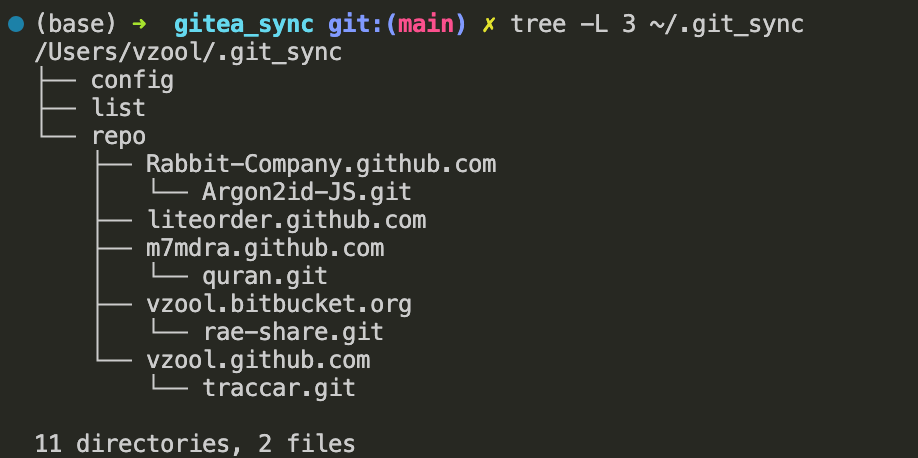
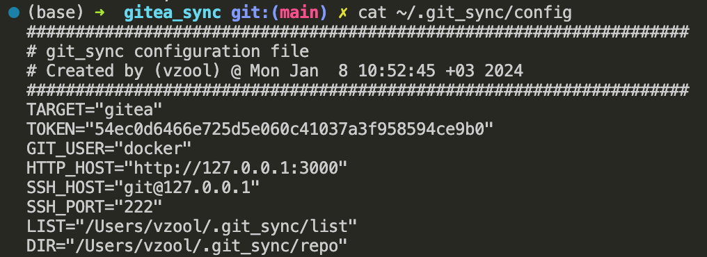
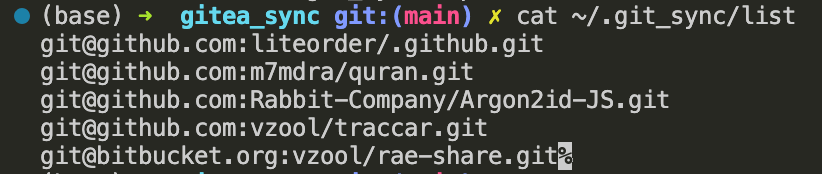

# [WIP] git_sync: Easily sync repositories between Git servers

## Overview

This script automates the process of syncing repositories from one Git server to another. It's designed to be flexible and supports multiple Git servers storage target through plugins.

When to sync `git@github.com:vzool/git_sync.git` for instance, `git_sync` will create a new repository name `git_sync` under a new orgnization name `vzool.github.com`.

So, things will be separated automatically by namespaces. :)

#### Support Plugins

- [x] [Gitea](https://about.gitea.com/).
- [x] [Gogs](https://gogs.io/).
- [ ] [OneDev](https://onedev.io/).
- [ ] [Github](https://github.com/).
- [ ] [BitBucket](https://bitbucket.org/).
- [ ] [GitLab](https://about.gitlab.com/).

## Installation / Update

```bash
curl -s https://raw.githubusercontent.com/vzool/git_sync/main/install.sh | bash -s --
```

## Uninstall

```bash
git_sync uninstall

# OR

curl -s https://raw.githubusercontent.com/vzool/git_sync/main/uninstall.sh | bash -s -- remove
```

## Usage

```bash
# 1) Create .git_sync directory at home directory
git_sync init 
# 2) Edit the list to add, update or remove of repositories to sync
git_sync list
# 3) Show loaded env
git_sync env
# 4) Run without confirmation
git_sync -y
```

- Ensure dependencies: Verify that required commands like git and curl are installed.
- Set up configuration:
    - If a configuration file doesn't exist, run git_sync init to create one interactively.
    - You can also manually edit the configuration file.
- Run the script:
    - Use the -v flag for verbose output.
    - Use the -y flag to skip confirmation prompts.

## Key Features

- Syncs repositories across Git servers: Clones repositories locally and pushes them to a target Git server, utilizing Git server APIs for organization and repository management.
- Supports multiple Git servers: Uses plugins to interact with different Git server platforms.
- Configurable: Employs a configuration file for settings and preferences.
- User-friendly: Offers interactive prompts and confirmations.
- Provides additional commands:
    - git_sync init: Create/Edit config file based on user input using interactive prompts.
    - git_sync list: Edit the list of repositories to sync.
    - git_sync config: Edit configuration variables.
    - git_sync env: Show loaded env.
    - git_sync size: Shows the size of locally stored repositories.
    - git_sync plugins: List available plugins.
    - git_sync install: Install git_sync.
    - git_sync uninstall: Uninstall git_sync.
    - git_sync version: Output version information and exit.

## Requirements

- SSH key pair already set for the Gitea server.
- SSH key pair already set for all source Git servers.
- `git` command line tool.
- Accesss Token with the following permissions:
    - write:organization
    - write:repository

## Example

To sync repositories listed in repos.txt to a Gitea server, run:

```bash
./git_sync init # Create .git_sync directory at home directory
./git_sync config # Show loaded config
./git_sync -y # Run without confirmation

# OR

ENV="/path/to/.env" ./git_sync

# OR

TOKEN="xxxxxx" USER="vzool" HTTP_HOST="http://192.168.88.248:3000" SSH_HOST="git@192.168.88.248" LIST="/path/to/git_sync_repo.txt" ./git_sync

# OR

TOKEN="xxxxxx" USER="vzool" HTTP_HOST="http://192.168.88.248:3000" SSH_HOST="git@192.168.88.248" SSH_PORT="22" LIST="git_sync_repo.txt" DIR="repo/" ./git_sync
```

## Anatomy





## Further Information

**Configuration file**: See config.example.sh for configuration options.

**Supported Git servers**: Currently supports Gitea only.

**Plugins**: Explore available plugins in the root directory, they are end up with `_plugin.sh` suffix.

**Contributing**: Feel free to contribute to the project!

## License

This project is licensed under the MIT License.

## Author

Abdelaziz Elrashed (c) 2024
